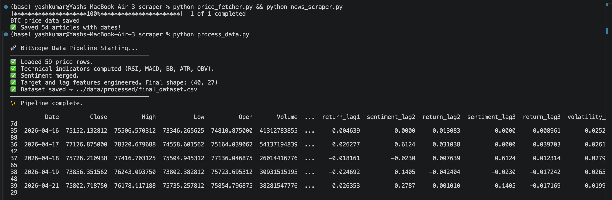

<h1 align="center">BitScope ₿</h1>
<p align="center">
<b>Advanced Bitcoin Sentiment Correlation & Price Estimation System</b>
</p>

<p align="center">


<br/>


<p align="center">

</p>

## Overview

**BitScope** is a financial intelligence tool designed to quantify the "fear and greed" of the cryptocurrency market. By scraping real-time news and social data and processing it through specialized **Natural Language Processing (NLP)** models, BitScope correlates public sentiment with Bitcoin price movements to provide actionable insights.

Unlike general sentiment tools, BitScope is optimized for financial vocabulary, allowing it to detect subtle market signals that standard models miss.

---

## System Architecture

The project is built as a modular pipeline, separating data acquisition from model inference:

| Directory | Component | Description |
|-----------|-----------|-------------|
| `scraper/` | **Data Ingression** | Automated scripts to fetch headlines and social signals. |
| `models/` | **Intelligence** | Pre-trained FinBERT weights and XGBoost regression models. |
| `notebooks/`| **Research** | Exploratory Data Analysis (EDA) and model validation. |
| `data/`    | **Storage** | Managed datasets for historical price and sentiment logs. |
| `app.py`   | **Interface** | Streamlit dashboard for real-time visualization. |

---

## The Pipeline

1. **Extraction**: Automated scrapers gather the latest Bitcoin-related news from high-authority sources.
2. **NLP Processing**: Text data is passed through **FinBERT**, a BERT model specifically pre-trained on financial corpora, to generate high-accuracy sentiment scores.
3. **Correlation Logic**: Sentiment scores are merged with OHLCV (Open, High, Low, Close, Volume) market data.
4. **Price Estimation**: An **XGBoost Regressor** analyzes the combined features to estimate potential short-term price trends.
5. **Real-time UI**: Insights are rendered onto an interactive Streamlit dashboard.

---

## Key Features

- **Specialized Sentiment Analysis**: Uses FinBERT to understand financial context (e.g., distinguishing "inflation" from "growth").
- **Volatility Mapping**: Visualizes how sharp drops in sentiment precede price corrections.
- **Automated Scraping**: Continuous data collection to keep predictions current.

---

## Tech Stack

- **Core**: Python 3.10+
- **Machine Learning**: FinBERT, Scikit-learn, XGBoost
- **Data Handling**: Pandas, NumPy, BeautifulSoup4
- **Visualization**: Streamlit, Matplotlib, Plotly

---

---

## Output Demonstration

BitScope processes real-time market data, technical indicators, and sentiment signals to generate actionable trading insights.  
Below are key outputs from different stages of the system:

---

### 1. Market Intelligence Dashboard

<table>
<tr>
<td width="60%">

</td>
<td width="40%">

**Live Market Overview**

- Real-time BTC/USD price tracking  
- RSI (Relative Strength Index)  
- Market sentiment score  
- ATR-based volatility estimation  

This dashboard provides a **quick snapshot of market conditions**, helping traders understand current momentum and risk.

</td>
</tr>
</table>

---

### 2. Technical Analysis Visualization

<table>
<tr>
<td width="60%">

</td>
<td width="40%">

**Multi-Indicator Analysis**

- Candlestick price movement  
- Bollinger Bands for volatility  
- RSI trend tracking  
- MACD crossover signals  
- Sentiment overlay  

This visualization helps identify:

- Trend direction  
- Overbought / oversold zones  
- Momentum shifts  

</td>
</tr>
</table>

---

### 3. AI Trading Signal

<table>
<tr>
<td width="60%">

</td>
<td width="40%">

**Model Prediction Output**

- AI-generated trade signal (**SHORT / LONG**)  
- Confidence score  
- Indicator confirmations (RSI, MACD, Sentiment)  

Example:
- RSI → Neutral  
- MACD → Bullish crossover  
- Sentiment → Neutral  

➡️ Final Decision: **Short Signal (Downward Trend)**  

</td>
</tr>
</table>

---

### 4. Model Training Results

<table>
<tr>
<td width="60%">

</td>
<td width="40%">

**Model Performance Metrics**

- Best hyperparameters from GridSearchCV  
- Cross-validation accuracy  
- Test accuracy  
- Precision / Recall / F1-score  

Example Results:
- Test Accuracy: **62.5%**  
- Model: **XGBoost Classifier**  

Model artifacts saved:
- `bitscope_xgb.pkl`  
- `bitscope_scaler.pkl`  

</td>
</tr>
</table>

---


---

### 5. Raw Data & Feature Engineering Output

<table>
<tr>
<td width="60%">

</td>
<td width="40%">

**Structured Dataset Snapshot**

- Historical BTC price data (Open, High, Low, Close)  
- Trading volume information  
- Technical indicators (RSI, MACD, ATR, Bollinger Bands %)  
- NLP-derived sentiment scores  
- Target labels for model training  

This table represents the **final engineered dataset** used by the machine learning model.  
It combines **market data + technical indicators + sentiment signals** into a unified structure.

Key Insights:
- Enables feature correlation analysis  
- Acts as input for XGBoost training  
- Provides transparency into model decision factors  

</td>
</tr>
</table>

### 6. Pipeline Execution Flow

```bash
price_fetcher.py → news_scraper.py → process_data.py → train_model.py → streamlit run app.py

## 🏁 Getting Started

### Installation

1. **Clone the repository:**
   ```bash
   git clone [https://github.com/Yash6163/BITSCOPE.git](https://github.com/Yash6163/BITSCOPE.git)
   cd BITSCOPE
